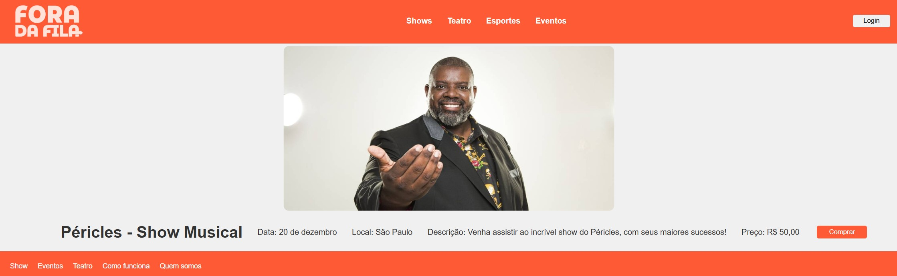

## Funcionalidades básicas

- Cadastro de Usuários: Sistema de cadastro e login para vendedores e compradores, com a opção de usar contas de redes sociais ou e-mail.

- Listagem de Ingressos: Interface para vendedores listarem ingressos, com opções para incluir detalhes como data, local, assento, e preço.

- Busca e Filtros: Sistema de busca avançada com filtros por data, local, preço, tipo de evento, etc., para facilitar a navegação dos compradores.

- Carrinho de Compras: Funcionalidade de carrinho de compras que permite ao usuário adicionar múltiplos ingressos antes de finalizar a compra.

- Processamento de Pagamento Seguro: Integração com gateways de pagamento para processar pagamentos de forma segura (cartão de crédito, PayPal, Pix, etc.).

## Funcionalidades de segurança

- Verificação de Autenticidade: Sistema de verificação de autenticidade dos ingressos para garantir que são legítimos.

## Funcionalidades de Gestão para Vendedores:

- Painel de Controle para Vendedores: Interface dedicada onde os vendedores podem gerenciar suas listagens, acompanhar vendas, ver estatísticas e acessar suporte.

- Histórico de Vendas: Registro detalhado das vendas, incluindo data, comprador e valor da transação.

## Funcionalidades Sociais:

- Compartilhamento em Redes Sociais: Botões para compartilhar ingressos ou eventos em plataformas como Facebook, Twitter, Instagram, etc.

## Protótipos

